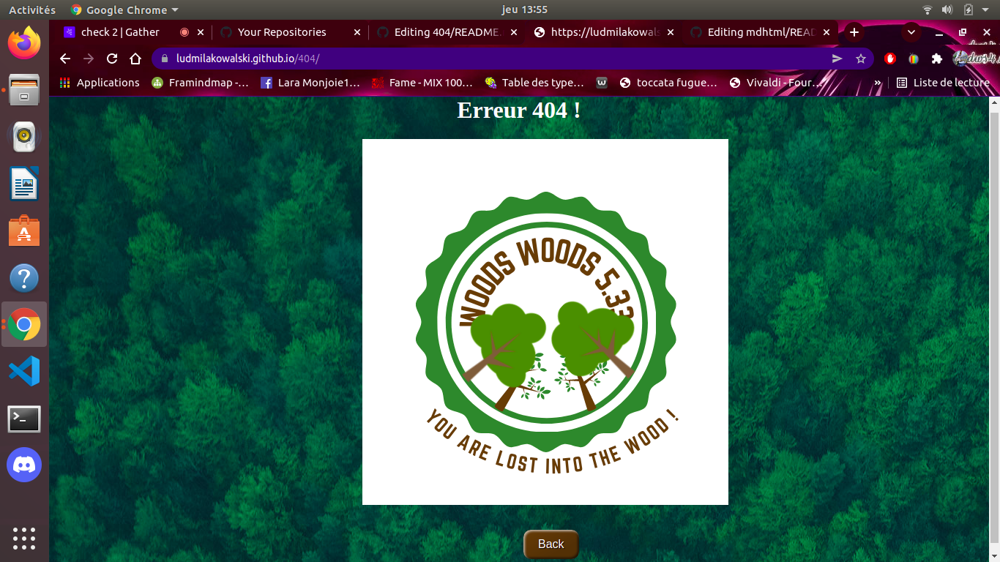

# 404

## Instruction

We had to create an error 404 page. I choosed this kind of design. 

## Techno

I used html but the main langage that I used was css. The aim of this exercice was to improve our skills in css.

## Result

You can see the result here : 

